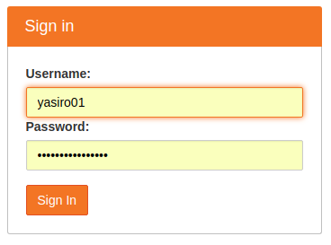
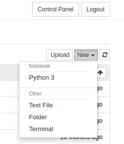

# README #

This is a repository for the Algorithms and Data Structures class.

### What is this repository for? ###

* Class notes
* Exercise and project templates

### How do I get set up? ###

* Login in to [Jupyter Hub on Knuth](https://knuth.luther.edu:8443/) using your Norse Key

* Start a new *Terminal* session (New - Terminal)

* In the new terminal that opens, type the following command and hit *Enter* or *Return*:

 `git clone https://github.com/yasiro01/ads-class-pub.git`

* Type `exit` and hit *Enter* or *Return*, then close the Terminal tab of your browser

* Use the Jupyter browser to navigate to **ads-class-pub/class_notes** directory

* Run (click) any notebook (ipynb file) and start working with the notes. Read more about Jupyter Notebooks and keyboard shortcuts at [The Jupyter Notebook — Jupyter Notebook 5.1.0rc2 documentation](http://jupyter-notebook.readthedocs.io/en/latest/notebook.html)

* Whenever you want to retrieve an update from the repository, start a new terminal and execute the following command to change the directory:

 `cd ads-class-pub`

 * Execute the following command to retrieve the latest changes of the repository:

 `git pull`

 * Keep in mind that you can always access the repository at [GitHub](https://github.com/yasiro01/ads-class-pub/). Also, most modern IDEs support Git and allow you to create projects from existing sources. See you specific IDEs documentation for details.
 
 * Good luck!

### Who do I talk to? ###

* Roman Yasinovskyy