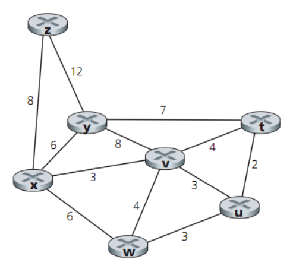

# Is it graph as in graphing calculator?

Complete the following tasks and submit your source code to KATIE as a single file (archive).

1. Assume the network graph in the picture above and use *Dijkstra's* algorithm to manually find the shortest path from vertex **w** to all other vertices in the network. Show each step of the algorithm.

2. Assume the network graph in the picture above and use *Dijkstra's* algorithm to manually find the shortest path from vertex **z** to all other vertices in the network. Show each step of the algorithm.

3. Add `__len____` method to the textbook implementation of the `Graph` class. It should print the number of vertices in a graph.

4. Add `size` method to the textbook implementation of the `Graph` class. It should print the number of edges in a graph. For the sake of simplicity, count edges from `a` to `b` and from `b` to `a` as a single edge.

5. Add `hub` property to the textbook implementation of the `Graph` class. It should return the vertex with the most **outgoing** connections (edges).
