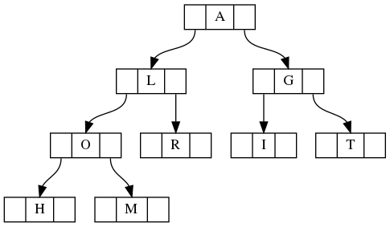

# Why is the root on top?

Complete the tasks assuming the following tree is given as input:

1. What is the result of _pre-order_ traversal of the tree in the picture?
1. What is the result of _in-order_ traversal of the tree in the picture?
1. What is the result of _post-order_ traversal of the tree in the picture?
1. Draw 3 _different_ trees with at least 8 nodes, so that the result of their _in-order_ traversal is the same.
1. Given the result of in-order tree traversal is _BDAEC_ and the result of post-order traversal is _DBECA_, what is the result of _pre-order_ traversal of the same tree?

## What to do

Use [Finite State Machine Designer](http://madebyevan.com/fsm/), [Graphviz](https://graphviz.readthedocs.io/en/stable/index.html), [Lucidchart](https://www.lucidchart.com/pages/), or another software package to draw trees.
