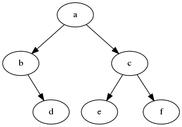

# Why is the root on top?

Complete the following tasks:



1. Implement function _height_, member of the class BinaryTree, that returns the height of a tree.
1. Implement function _size_, member of the class BinaryTree, that returns the number of nodes in a tree.
1. Write a function build_tree_lst() that uses textbook implementation of a tree as a **list of lists** and returns a tree that looks like the one in the attached image.
1. Write a function build_tree_oop() that uses textbook implementation of a tree as **nodes and references** and returns a tree that looks like the one in the attached image.
1. What is the result of _pre-order_ tree traversal of the tree in the picture?
1. What is the result of _in-order_ tree traversal of the tree in the picture?
1. What is the result of _post-order_ tree traversal of the tree in the picture?

## What to do

`python3` should be `python3.9` or newer.

- Read _src/exercises/trees/description.md_ (this file).
- Modify _src/exercises/trees/trees.py_.
- Run _src/exercises/trees/trees_main.py_.

```bash
python3 src/exercises/trees/trees_main.py
```

- Compare your output to that provided in _tests/exercises/trees/trees_output.txt_.
- Test your implementation.

```bash
python3 -m pytest tests/exercises/trees/test_trees.py
```
