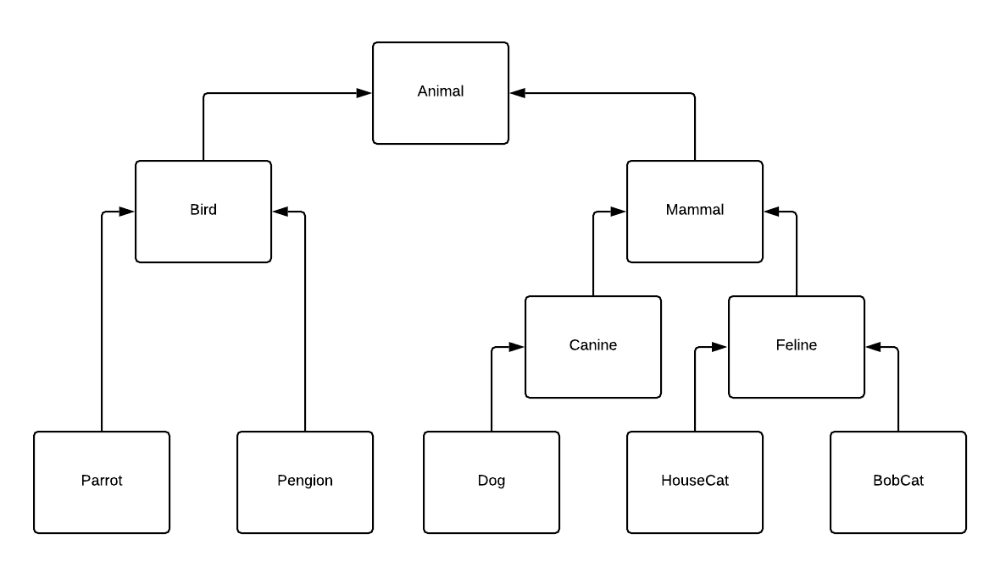

# Animal Kingdom

Use the principles of object-oriented programming and implement the missing functionality of the following classes.

Classes `Animal`, `Penguin`, `Canine`, `Feline`, and `HouseCat` are implemented. You need to complete the other 5 classes in the following hierarchy:



You should take advantage of inheritance and call `super()` wherever applicable.

1. Complete class `Bird`
   - extends `Animal`
   - has boolean data attribute `_flying`
1. Complete class `Mammal`
   - extends `Animal`
   - has data attribute `_habitat` that can be **Land**, **Sea**, **Air**, or **Tree**
1. Complete class `Parrot`
   - extends `Bird`
   - has boolean data attribute `_talking`
1. Complete class `Dog`
   - extends `Canine`
   - all dogs live on **Land**
   - all dogs make **Woof!** sound
1. Complete class `BobCat`
   - extends `Feline`

## What to do

- Read _src/exercises/zoo/description.md_ (this file).
- Modify _src/exercises/zoo/zoo\_classes.py_.
- Run _src/exercises/zoo/zoo\_main.py_.

```bash
python3src/exercises/zoo/zoo_main.py
```

- Compare your output to that provided in _tests/exercises/zoo/zoo\_output.txt_.
- Test your implementation.

```bash
python -m pytest tests/exercises/zoo/test_zoo.py
```
